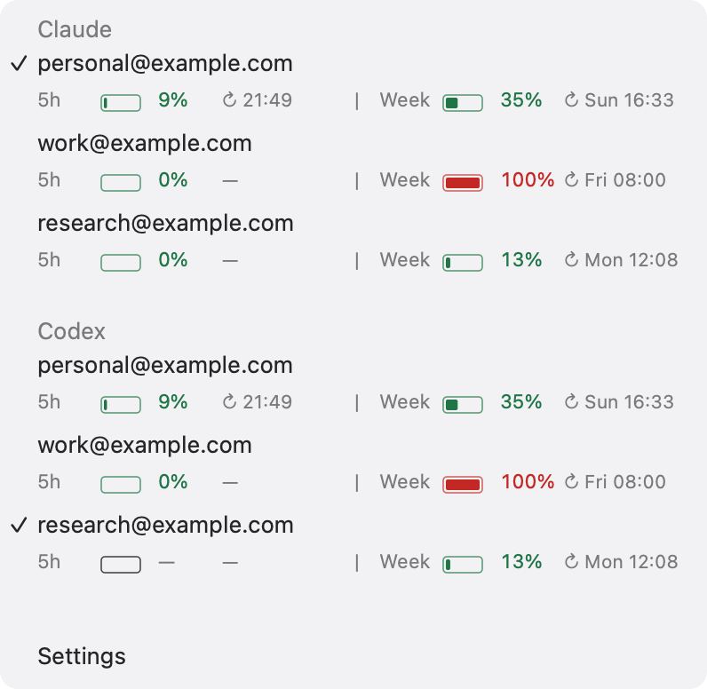
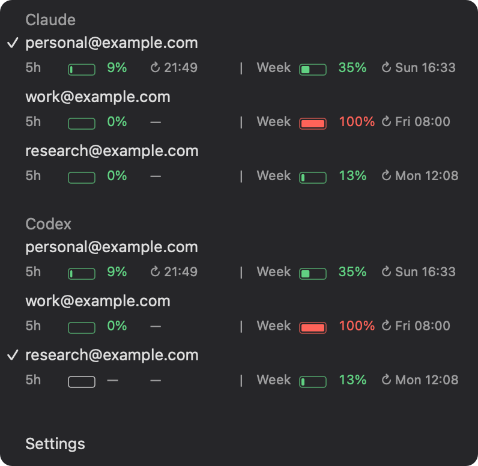

# Claude & Codex Switcher

A small native macOS menu bar app with separate Claude and Codex sections. Claude selection coordinates Claude Code with Claude.ai in Chrome. Codex selection changes the ordinary Codex Desktop and CLI login. Five-hour and weekly usage share one compact line, separated by `|`.

<p>
  
  
</p>

<sub>Component previews with example accounts. Available usage windows depend on the provider.</sub>

## Claude accounts

1. Choose an email in the menu bar.
2. Claude.ai uses that account in your connected Chrome profile.
3. In your existing Ghostty, iTerm2, or other terminal, stop Code when ready and run `claude --resume` or `claude --continue`.

Switching does not open a terminal. Your working directory, normal `~/.claude` history, and setup stay in place. Already-running Code sessions are not stopped; restarting them is the reliable way to use the selected account immediately. Claude's own credential cache can delay changes inside a running process.

The menu-bar icon spins during a switch. A green check appears for three seconds after success. A red warning stays visible after failure; amber means Code switched but Chrome still needs attention. The selected account updates as soon as the switch is verified.

Code and Chrome have separate credentials. The switcher coordinates them; it does not run `/login` on every switch. Initial authorization is required once per account, and expired or revoked logins may need authorization again.

## Codex accounts

The Codex section uses the three email labels configured in the Claude profiles unless `~/.config/claude-switcher/codex-settings.json` overrides them. Connect each account once through the official Codex browser login; the switcher verifies the login and saves it in macOS Keychain. If a saved login expires, use **Settings → Reconnect Codex account**.

Selecting a saved email verifies the target before asking Codex to quit normally. It then activates the official `auth.json` in the ordinary `~/.codex` directory, verifies identity and usage, and reopens Codex through `NSWorkspace`. The switcher never force-quits Codex. If active work prevents a normal quit, finish that work and try again.

Already-running Codex CLI processes cache their login and need to be restarted or resumed after a switch. The ChatGPT website account is separate and is not switched. If `cli_auth_credentials_store` is set to the unsupported `keyring`, `auto`, or `ephemeral` mode, switching fails without changing that setting.

The Desktop restart is still required by this integration. Codex supports account changes through its own app-server connection, but does not expose a supported external reload command for an already-running Desktop app. Updating `auth.json` alone does not replace its cached login.

Aliases are optional. They map a displayed email label to the account's actual provider email:

```json
{
  "emails": ["first@example.com", "second@example.com", "third@example.com"],
  "aliases": {
    "first@example.com": "provider@example.com"
  }
}
```

The bundled executable also exposes the Codex account operations directly:

```sh
APP="/Applications/Claude Switcher.app/Contents/MacOS/claude-switcher"
"$APP" --codex-accounts
"$APP" --codex-connect person@example.com
"$APP" --codex-switch person@example.com
```

## Install

Requires **macOS 14+**, a **Swift 6 toolchain**, [Claude Code](https://code.claude.com/docs/en/setup), and [uv](https://docs.astral.sh/uv/getting-started/installation/) for the Claude account backend. Install the official Codex desktop app to use the Codex section.

```sh
git clone https://github.com/paperfoot/claude-switcher.git
cd claude-switcher
uv tool install 'claude-swap==0.26.0'
CODESIGN_IDENTITY=- make install
python3 scripts/setup-coordinated.py
open -a "Claude Switcher"
```

Quit an older copy before replacing it. This is a local build, signed on your Mac; this fork does not currently provide a notarized download.

The setup script imports the Code accounts already configured in `~/.config/claude-switcher/config.json`. It registers the local Chrome companion host and leaves the active Code account unchanged. It never overwrites an account already saved in the backend. Existing authenticated profiles can be configured with `expectedEmail` and `credDir`; both Claude directory selectors must refer to the directory used when that profile signed in.

### Connect Chrome once

Chrome requires a user to load an unpacked extension. The installer does not change browser policies or force-install anything.

1. Open `chrome://extensions`, enable **Developer mode**, and choose **Load unpacked**.
2. Select `~/Library/Application Support/Claude Switcher/BrowserExtension`.
3. Sign in to a configured account at Claude.ai. The companion saves it automatically; its popup shows the detected email and also offers **Save this Claude login**.
4. Choose **Add another account** in the companion, then sign in to the next account. This clears the browser session locally without calling Claude’s logout endpoint, so saved sessions are not intentionally revoked. Repeat once per configured account.

Pin the companion if you want to switch from Chrome too. **Settings → Connect Claude…** opens the setup guide.

After updating the app and rerunning the setup script, open `chrome://extensions` and click **Reload** on **Claude Switcher Companion**. Chrome can retain an unpacked extension's old code even after a browser restart. Your saved accounts stay in Keychain.

If Chrome is closed, selection switches Code immediately. When the companion reconnects, it restores the pending selection from the saved browser login. If that login has expired, sign in again through **Add another account**. The app only reports **Chrome and Code switched** after both sides verify the selected email. If the companion rejects a selection, the coordinator tries to restore the previous Code account and reports the failure.

## Usage at a glance

Tiny rounded gauges show the five-hour and weekly **percentage consumed** on the same line, with a `|` separator and reset times in your timezone. Green is below 70%, amber is 70–89%, and red is 90% or higher. A limit that the provider does not return is unavailable (`—` in the gauge), not zero.

Readings refresh in the background about every five minutes and when due after wake. While the menu is open, values update in place; its width, row positions and account labels stay fixed. Cached values survive restarts and stay visible in gray while refreshing. A passed reset is marked as due rather than inventing a fresh zero. Cached readings expire after seven days.

## How switching works

- **Code:** [claude-swap 0.26.0](https://github.com/realiti4/claude-swap/releases/tag/v0.26.0) saves and restores the default Claude Code credentials and account metadata, cooperating with Claude's credential locks. Code keeps using its usual history directory. The backend handles token refresh and usage collection.
- **Chrome:** a Manifest V3 extension saves Claude.ai sessions in the Mac's **Keychain**, through a local native-messaging host. It verifies the current email before saving, checks the restored email after switching, and restores the previous cookies if switching fails. No cookies are saved in extension storage or exported by diagnostics.
- **Connection:** a private local Unix socket connects the menu app to Chrome's native host. The host accepts the companion's exact extension origin. There is no listening network port or remote debugging connection.

The extension touches Claude.ai cookies only. It does not switch Google accounts, Gmail, or unrelated sites. All Claude.ai tabs within the connected Chrome profile share the selected login; switching can reload them. Claude Desktop still has a separate sign-in and is available under **Settings → Claude Desktop**.

Claude's cookie and credential formats are not public compatibility contracts. Changes in Claude can require maintenance. Chrome switching is supported for one connected regular browser profile at a time.

## Claude Desktop Code history

Turn on **Settings → Claude Desktop → Share Code history** to carry local Code conversations across Desktop accounts. This requires Node.js 22 or newer at `~/.local/bin/node`, `/opt/homebrew/bin/node`, or `/usr/local/bin/node`.

After a verified Desktop sign-in, the switcher waits for open Code processes to close, then normally quits Claude, copies missing sidebar entries and reopens the same Desktop profile. Existing entries in both accounts are preserved. Project paths, conversation IDs, transcripts and sidecars stay in place. This feature follows the account signed into Desktop; selecting a Chrome/Code account does not sign Desktop in.

Only accounts already configured in the switcher are included. Missing transcripts are skipped. Changed or conflicting records and scheduled sessions stop the transfer. History from a removed project folder remains available; restore or select its folder before resuming work. New copies use your `permissions.defaultMode` from `~/.claude/settings.json`, or Manual if unset. Account-specific connector grants and Remote Control links are cleared. Cloud chats and Cowork sessions are excluded.

Desktop also remembers permission modes per folder and per session. Bypass requires the account's **Allow bypass permissions mode** setting. Browser and macOS approval prompts have separate controls; see [Claude's permission modes](https://code.claude.com/docs/en/permission-modes#switch-permission-modes).

For terminal sessions that have never appeared in Desktop, use Claude's **Help → Troubleshooting → Import Claude Code CLI Sessions…**. Claude imports eligible local transcripts and refreshes its sidebar immediately. The switcher can then carry those entries across your configured Desktop accounts.

**Sync history now** retries a stopped sync. Recovery records live privately in `~/.config/claude-switcher/desktop-history`. **Undo last history sync** removes the entries added by the latest sync while Claude is closed and disables automatic sharing. Undo refuses changed destination records; original account entries and newer transcript content stay intact.

Sidebar syncing copies small local records without rescanning conversation contents. Atomic file writes, process checks, locking and legacy recovery use code adapted from [claude-transplant 4.1.0](https://github.com/vitaliyhayda/claude-transplant). See the [pinned source and local changes](ThirdParty/ClaudeTransplant-NOTICE.md).

## Diagnostics

```sh
APP="/Applications/Claude Switcher.app/Contents/MacOS/claude-switcher"
"$APP" --switch person@example.com
"$APP" --switch-status
"$APP" --accounts
```

Diagnostics contain account emails and usage, not tokens or cookies. Redact personal details before posting an issue. An `ok: true` result with `browserReady: false` means Code switched and Chrome still needs setup.

Settings and usage cache live in `~/.config/claude-switcher/`, with private file permissions. The installed companion lives in `~/Library/Application Support/Claude Switcher/`. The Code backend manages its own account store under `~/.claude-swap-backup/`.

## Development

Enable startup through **Settings → Open at login**, or run the installed executable with `--login-item on`. Use `--login-item status` to verify registration.

```sh
swift test
scripts/check-menu-refresh.sh
node --test history/*.test.mjs
node --test browser-extension/*.test.js
python3 -m unittest discover -s bridge -p 'test_*.py'
swift build -c release
CODESIGN_IDENTITY=- scripts/bundle.sh
```

Tests cover account isolation, usage caching, identity verification, cookie restoration, rollback, concurrent selections, and native-message framing. See [CONTRIBUTING.md](CONTRIBUTING.md).

## Credits and license

Maintained by [Paperfoot](https://github.com/paperfoot). Forked from [Kevin Chau's Claude Switcher](https://github.com/kevinchau/claude-switcher), with original history and MIT attribution preserved. Coordinated Code switching uses [Onur Cetinkol's claude-swap](https://github.com/realiti4/claude-swap), also MIT licensed. The Codex app-server RPC transport adapts code from [liuzhao1225/codex-account-switcher](https://github.com/liuzhao1225/codex-account-switcher) under the MIT license, for the RPC transport only; see [ThirdParty/CodexAccountSwitcher-LICENSE](ThirdParty/CodexAccountSwitcher-LICENSE).

Licensed under [MIT](LICENSE). Not affiliated with Anthropic or OpenAI.
